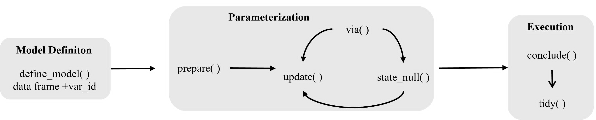

# Getting started with statim

## Introduction

[statim](https://github.com/s7-stats/statim) provides a modified
approach of high-level statistical inference in R. It is fully
declarative, built for statistical inference pipelines, made to be
extensible and exportable. This package is built at top of S7, and its
design inherits the traditional R idiom:

``` r
<<statistical-function>>(<formula>, <data>)
```

But it brings that idiom into a composable, pipe-friendly and readable
with grammar syntax — much close in spirit to
[ggplot2](https://ggplot2.tidyverse.org) or
[dplyr](https://dplyr.tidyverse.org).

## General Workflow



The usual [statim](https://github.com/s7-stats/statim) workflow has
three (3) stages:

### i. Model definition and processing

The stage where you define the shape of the model to be analyzed. This
always happens at the beginning of the pipeline. [](#model-id) objects
describe the shape of the inference, e.g. what variable, what grouping,
what relationship, while functions like
[`define_model()`](https://s7-stats.github.io/statim/reference/layout-define-base.md)
binds that shape to data.

There are two ways to start a pipeline:

1.  [`define_model()`](https://s7-stats.github.io/statim/reference/layout-define-base.md)
    to define one model at a time.

    ``` r

    sleep_dm = define_model(sleep, extra %by% group)
    mtcars_dm = define_model(mtcars, mpg ~ .)
    # mtcars_dm = define_model(mpg ~ ., mtcars)
    ```

2.  [`write_models()`](https://s7-stats.github.io/statim/reference/write_models.md)
    to define multiple named models at once.

    ``` r
    sleep_wm = write_models(
        sleep,
        mod1 = extra %by% group,
        mod2 = extra %by% c(group, ID),
        mod3 = extra ~ 1
        mod4 = extra ~ 1 + group
    )
    ```

Future updates will include transformations and model updating
functions.

### ii. Parameterization

This stage is always AFTER the model is defined that shapes a certain
statistical inference pipeline to be analyzed, a stage which defines the
estimation process of the statistical inference. It is either a
model-based inference (e.g. linear regression) or H-test inference
(e.g. t-test). They are lazy-loaded, and nothing is executed yet.

Let’s try with the two common forms of statistical inference:

1.  H-test inference uses
    [`prepare_test()`](https://s7-stats.github.io/statim/reference/prepare-test.md)

    ``` r

    sleep_dm = define_model(sleep, extra %by% group)
    sleep_tt = sleep_dm |> prepare_test(TTEST) |> update(.ci = 0.9)
    ```

2.  Model-based inference uses
    [`prepare_model()`](https://s7-stats.github.io/statim/reference/prepare-model.md)

    ``` r

    mtcars_dm = define_model(mtcars, mpg ~ .)
    mtcars_lm = mtcars_dm |> prepare_model(LINEAR_REG)
    ```

> Note:
> [`prepare_test()`](https://s7-stats.github.io/statim/reference/prepare-test.md)
> and
> [`prepare_model()`](https://s7-stats.github.io/statim/reference/prepare-model.md)
> can supply extra arguments from the default (base) implementation of
> `<STAT_FN>` functions like
> [`TTEST()`](https://s7-stats.github.io/statim/reference/TTEST.md) and
> [`LINEAR_REG()`](https://s7-stats.github.io/statim/reference/LINEAR_REG.md).
> Using [`update()`](https://rdrr.io/r/stats/update.html) is totally
> optional.

Later updates may include other processes, such as sensitivity analysis.

### iii. Execution and retrieval

The lazy pipeline from stages i and ii is executed here, and results are
retrieved. The primary function is
[`conclude()`](https://s7-stats.github.io/statim/reference/conclude.md),
and [`tidy()`](https://s7-stats.github.io/statim/reference/tidy.md) can
be chained after it when tidy output methods are registered.

``` r

out = conclude(sleep_tt)
print(out)
tidy(out)
```

### A complete example

[statim](https://github.com/s7-stats/statim) is intentionally making the
syntax pipe-able. Since the pipeline is pipe-able, the three stages read
like a sentence:

``` r

# t-test example
sleep |> 
    define_model(extra %by% group) |> 
    prepare_test(TTEST) |> 
    update(.ci = 0.9) |> 
    conclude() |> 
    tidy()
#> # A tibble: 1 × 7
#>   group estimate t_stat    df  p_val lower_90 upper_90
#>   <chr>    <dbl>  <dbl> <dbl>  <dbl>    <dbl>    <dbl>
#> 1 group    -1.58  -1.86  17.8 0.0794    -3.05   -0.107

# Linear regression example
mtcars |> 
    define_model(mpg ~ .) |> 
    prepare_model(LINEAR_REG) |> 
    conclude() |> 
    tidy()
#> # A tibble: 11 × 5
#>    term        estimate std_error statistic p_value
#>    <chr>          <dbl>     <dbl>     <dbl>   <dbl>
#>  1 (Intercept)  12.3      18.7        0.657  0.518 
#>  2 cyl          -0.111     1.05      -0.107  0.916 
#>  3 disp          0.0133    0.0179     0.747  0.463 
#>  4 hp           -0.0215    0.0218    -0.987  0.335 
#>  5 drat          0.787     1.64       0.481  0.635 
#>  6 wt           -3.72      1.89      -1.96   0.0633
#>  7 qsec          0.821     0.731      1.12   0.274 
#>  8 vs            0.318     2.10       0.151  0.881 
#>  9 am            2.52      2.06       1.23   0.234 
#> 10 gear          0.655     1.49       0.439  0.665 
#> 11 carb         -0.199     0.829     -0.241  0.812
```

### Eager Form

There are times where you do not need the full pipeline, a quick eager
form can do that. For a quick one-shot result, every test exposes an
eager form that skips
[`define_model()`](https://s7-stats.github.io/statim/reference/layout-define-base.md)
and
[`prepare_test()`](https://s7-stats.github.io/statim/reference/prepare-test.md)
entirely:

``` r

TTEST(extra %by% group, sleep, .ci = 0.9)
#> -- Summary ---------------------------------------------------------------------
#> 
#> ──────────────────────────────────────────
#>   group  estimate  t_stat    df    p_val  
#> ──────────────────────────────────────────
#>   group   -1.580   -1.861  17.780  0.079  
#> ──────────────────────────────────────────
#> 
#> 
#> -- Confidence Interval ---------------------------------------------------------
#> 
#> ─────────────────────────────
#>   group  lower_90  upper_90  
#> ─────────────────────────────
#>   group   -3.053    -0.107   
#> ─────────────────────────────
LINEAR_REG(mpg ~ ., mtcars)
#> -- Coefficients ----------------------------------------------------------------
#> 
#> ──────────────┬───────────────────────────────────────────
#>   term        │  estimate  std_error  statistic  p_value  
#> ──────────────┼───────────────────────────────────────────
#>   (Intercept) │   12.303    18.718      0.657     0.518   
#>   cyl         │   -0.111     1.045     -0.107     0.916   
#>   disp        │   0.013      0.018      0.747     0.463   
#>   hp          │   -0.021     0.022     -0.987     0.335   
#>   drat        │   0.787      1.635      0.481     0.635   
#>   wt          │   -3.715     1.894     -1.961     0.063   
#>   qsec        │   0.821      0.731      1.123     0.274   
#>   vs          │   0.318      2.105      0.151     0.881   
#>   am          │   2.520      2.057      1.225     0.234   
#>   gear        │   0.655      1.493      0.439     0.665   
#>   carb        │   -0.199     0.829     -0.241     0.812   
#> ──────────────┴───────────────────────────────────────────
#> 
#> 
#> -- Model Fit -------------------------------------------------------------------
#> Warning in system("tput cols", intern = TRUE): running command 'tput cols' had
#> status 2
#> ------------------------------------------------------
#>   R Squared      :    0.87    F-statistic :    13.93
#>   Adj. R Squared :    0.81    df1         :       10
#>   Sigma          :    2.65    df2         :       21
#>   n              :      32    p-value     :   <0.001
#>   df (residual)  :      21                :         
#> ------------------------------------------------------
```

The eager form accepts the same model ID and data arguments, pass the
rest of arguments, and returns the same printed output. The only
constraints the “eager form” compensates is you can’t use the rest of
the API, such as switching between modes (recalibration) using
[`via()`](https://s7-stats.github.io/statim/reference/via.md) or
extracting the output in a data frame structure with
[`tidy()`](https://s7-stats.github.io/statim/reference/tidy.md).

## Model IDs: Emulation of formulas

Now you know the usual workflow of
[statim](https://github.com/s7-stats/statim), now let’s talk about
`<model_id>` objects. Empirically, they are functions that emulate the
`<formula>` (and its idiom) to describe the shape of a statistical
inference. Normally, they all inherit from the abstract S7 class
`<model_id>`, and they should be built within S7. Here, we have
`<formula>` and is used to describe the relationship between LHS
(left-hand side) and RHS (right-hand side), but `<model_id>` take it on
another different level.

[statim](https://github.com/s7-stats/statim) provides the following
built-in model IDs:

1.  [`x_by()`](https://s7-stats.github.io/statim/reference/x_by.md):
    When used, it is simply translated as “compare x by group”. It
    requires 2 main arguments: `x` and `group`, and it is ideal for
    pipelines which compares `x` by `group`. Moreover, you can
    alternatively use its infix operator version `%by%`.

    ``` r

    # In a function call
    x_by(x, group)
    x_by(x, c(g1, g2))

    # infix form
    x %by% group
    x %by% c(g1, g2)
    ```

    Both `x` and `group` accept `<tidyselect>` helpers, such as
    `starts_with()`. Only when a data frame is supplied.

2.  [`rel()`](https://s7-stats.github.io/statim/reference/rel.md): It
    simply reads the expression once used as “relationship between x and
    y”. It requires 2 main arguments: `x` and `resp`, and it is ideal
    for pipelines which describes the relationship of `x` to `resp`.

    ``` r

    rel(x, y)
    ```

    Both `x` and `resp` accept `<tidyselect>` helpers, such as
    `starts_with()`. Only when a data frame is supplied.

3.  [`pairwise()`](https://s7-stats.github.io/statim/reference/pairwise.md):
    With this function, all variables being selected by it generate all
    pairwise combinations. Use `direction` to regulate which pairs are
    kept, and it’s `"lt"` (less than) by default.

    ``` r

    pairwise(x, y, z)
    ```

    Note: When using `direction`, the filtration is based on
    lexicographic (alphabetical) ordering. Basically, `direction = "lt"`
    means “keep pairs where `name_a` comes before `name_b`
    alphabetically”. Also, it accepts `<tidyselect>` helpers if a data
    frame is given.

4.  [`prop()`](https://s7-stats.github.io/statim/reference/prop.md): Use
    this when the data is just a single observed count, namely the
    number of successes `x` out of `n` trials. Unlike the other model
    IDs, [`prop()`](https://s7-stats.github.io/statim/reference/prop.md)
    takes scalar constants directly; no variable names or data frame is
    involved.

    ``` r

    prop(45, 100)   # 45 successes out of 100 trials
    ```

    Because the data is embedded in the model ID itself,
    [`define_model()`](https://s7-stats.github.io/statim/reference/layout-define-base.md)
    does not require a data frame:

    ``` r

    define_model(prop(45, 100))
    ```

And if you are familiar with `aes()` (aesthetics) mapper from
[ggplot2](https://ggplot2.tidyverse.org) package, they are indeed more
like mappers, where they capture the expression internally, instead of
evaluating them immediately. In fact, `aes()` heavily inspires
`<model_id>` with the exception of having varieties. Take note that
`<model_id>` abstract S7 class must be carried around as you create
another `<model_id>` object (see more
[details](https://s7-stats.github.io/statim/articles/pointers/model_id.html)).

When no data frame is supplied,
[statim](https://github.com/s7-stats/statim) looks up the variable names
from the current environment (global environment by default). If you
want to avoid creating intermediate variables, use
[`I()`](https://rdrr.io/r/base/AsIs.html) for a single inline value or
multiple inline codes at once with
[`inlines()`](https://s7-stats.github.io/statim/reference/inlines.md):

``` r

I(rnorm(30)) %by% I(rep(c("a", "b"), each = 30))
rel(I(rnorm(30)), I(rnorm(30)))
pairwise(inlines(rnorm(30), rnorm(30), rnorm(30)))
```

## Recalibrating the estimation method

[statim](https://github.com/s7-stats/statim) has a way to recalibrate
the method of estimation in the statistical inference pipeline. Use
[`via()`](https://s7-stats.github.io/statim/reference/via.md) to switch
a lazy pipeline from the default estimation method to an alternative
estimation method. It updates the specification while the whole grammar
syntax pipeline is defused before
[`conclude()`](https://s7-stats.github.io/statim/reference/conclude.md)
executes it. Any named arguments after `.method` are forwarded to that
variant.

For example, switching from a classical t-test to a permutation test is
a single added line, with nothing else changing:

``` r

# Classical
sleep |>
    define_model(x_by(extra, group)) |>
    prepare_test(TTEST) |>
    conclude()
#> 
#> == Model ======================================================================= 
#> 
#> Variable Mapper : x_by 
#> Args : extra | group 
#>     x_vars : 1 
#>     by_vars : 1 
#> 
#> == T-Test ====================================================================== 
#> 
#> -- Summary ---------------------------------------------------------------------
#> 
#> ──────────────────────────────────────────
#>   group  estimate  t_stat    df    p_val  
#> ──────────────────────────────────────────
#>   group   -1.580   -1.861  17.780  0.079  
#> ──────────────────────────────────────────
#> 
#> 
#> -- Confidence Interval ---------------------------------------------------------
#> 
#> ─────────────────────────────
#>   group  lower_95  upper_95  
#> ─────────────────────────────
#>   group   -3.365    0.206    
#> ─────────────────────────────

# Permutation: one line added
sleep |>
    define_model(x_by(extra, group)) |>
    prepare_test(TTEST) |>
    via("permute", n = 999L) |>
    conclude()
#> 
#> == Model ======================================================================= 
#> 
#> Variable Mapper : x_by 
#> Args : extra | group 
#>     x_vars : 1 
#>     by_vars : 1 
#> 
#> == T-Test · permute ============================================================ 
#> 
#> ============================== T-test Permutation ==============================
#> 
#> 
#> -- Summary ---------------------------------------------------------------------
#> 
#> ───────────────────────────────
#>   Statistic  p-value  n_perms  
#> ───────────────────────────────
#>    -1.580     0.102     999    
#> ───────────────────────────────
```

## Hypothesis expressions

One of [statim](https://github.com/s7-stats/statim)’s distinguishing
features is the ability to state the null hypothesis as a mathematical
expression. The conventional approach in R uses declarative string
gotchas like `alternative = "less"`. While concise, this encodes only a
direction: it does not name the population parameter being constrained
or the value it is being tested against. You cannot read
`alternative = "greater"` and know whether the claim is about a mean, a
proportion, or a correlation without reading the surrounding context.

[statim](https://github.com/s7-stats/statim) still supports this
approach (if defined under `stat_define`) by updating the arguments, but
[statim](https://github.com/s7-stats/statim) provides a recommendable
approach: an explicit hypothesis DSL (domain specific language) built
from `<param_obj>` objects and standard R comparison operators. The
expression names the population parameter, the relational operator, and
the hypothesized scalar — the same three components that appear in any
textbook null hypothesis statement. Internally,
[`state_null()`](https://s7-stats.github.io/statim/reference/null-hyp.md)
parses the expression, extracts those components, and passes them into
the `fn` implementation from
[`baseline()`](https://s7-stats.github.io/statim/reference/baseline.md)
or
[`variant()`](https://s7-stats.github.io/statim/reference/variant.md).
Any linear combination of parameters is accepted on either side.

The supported operators are `==`, `!=`, `<`, `>`, `<=`, `>=`, and `%=%`
(simultaneous equality across multiple parameters). Here are the current
built-in `<param_obj>` objects:

- [`MU()`](https://s7-stats.github.io/statim/reference/MU.md): refers to
  the population mean \mu. It has following usages:

  1.  `MU(x)` which means the assumed population mean of the variable
      `x`.

  2.  `MU(x, group == "1")` which means the assumed population mean of
      the variable `x` given the `group` equal `"1"`.

- [`RHO()`](https://s7-stats.github.io/statim/reference/RHO.md): or \rho
  which refers to the population correlation between 2 variables —
  `RHO(x, y) == 0` simply means the true population correlation between
  `x` and `y` is 0 or \rho\_{x, y} = 0.

- [`PI()`](https://s7-stats.github.io/statim/reference/PI.md): refers to
  the population proportion \pi. Used with
  [`prop()`](https://s7-stats.github.io/statim/reference/prop.md)
  pipelines. It accepts zero or one argument:

  1.  [`PI()`](https://s7-stats.github.io/statim/reference/PI.md) — the
      population proportion of the modelled count, when the variable
      name is already encoded in the model ID via
      [`prop()`](https://s7-stats.github.io/statim/reference/prop.md)
      (see
      [`?P_TEST`](https://s7-stats.github.io/statim/reference/P_TEST.md)).

  2.  `PI(x)` — the population proportion of a named variable `x`, for
      future two-sample proportion tests.

As an example, consider the built-in `sleep` dataset. It records the
extra hours of sleep (`extra`) gained by 10 patients under each of two
drugs (`group`). A researcher wants to know whether drug 1 produces less
additional sleep than drug 2 on average.

The null hypothesis is that drug 1 is at least as effective — that is,
the mean extra sleep under drug 1 is greater than or equal to that under
drug 2:

\mu\_{x\|\text{group}=1} \geq \mu\_{x\|\text{group}=2}

``` r

sleep |>
    define_model(extra %by% group) |>
    prepare_test(TTEST) |>
    state_null(
        MU(extra, group == "1") >= MU(extra, group == "2")
    ) |>
    conclude()
#> 
#> == Model ======================================================================= 
#> 
#> Variable Mapper : x_by 
#> Args : extra | group 
#>     x_vars : 1 
#>     by_vars : 1 
#> 
#> == T-Test ====================================================================== 
#> 
#> -- Summary ---------------------------------------------------------------------
#> 
#> ──────────────────────────────────────────
#>   group  estimate  t_stat    df    p_val  
#> ──────────────────────────────────────────
#>   group   -1.580   -1.861  17.780  0.040  
#> ──────────────────────────────────────────
#> 
#> 
#> -- Confidence Interval ---------------------------------------------------------
#> 
#> ─────────────────────────────
#>   group  lower_95  upper_95  
#> ─────────────────────────────
#>   group    -Inf     -0.107   
#> ─────────────────────────────
```
