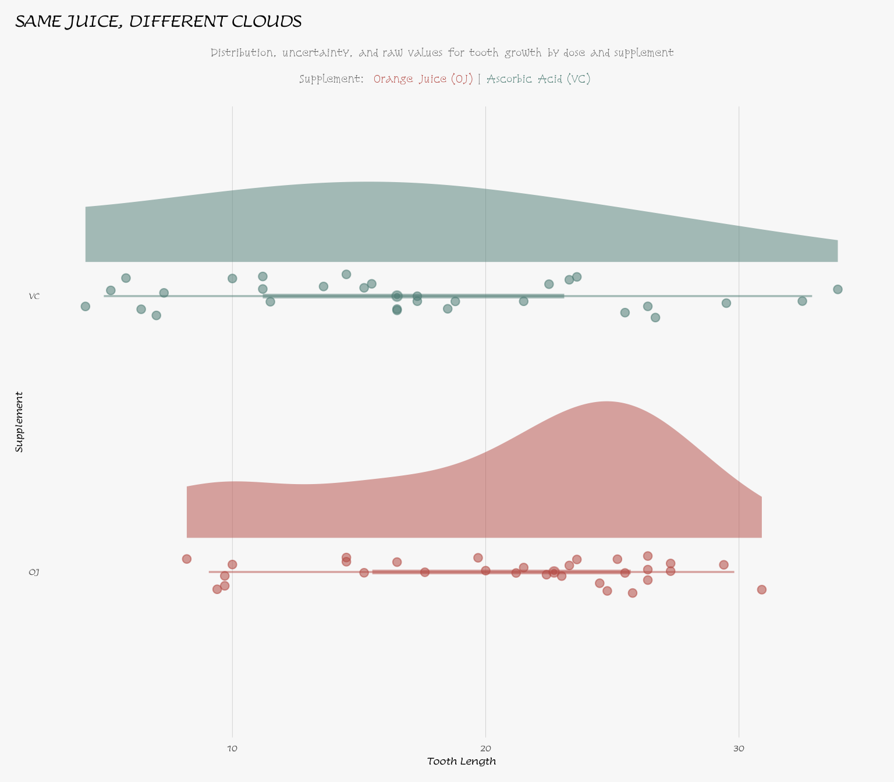
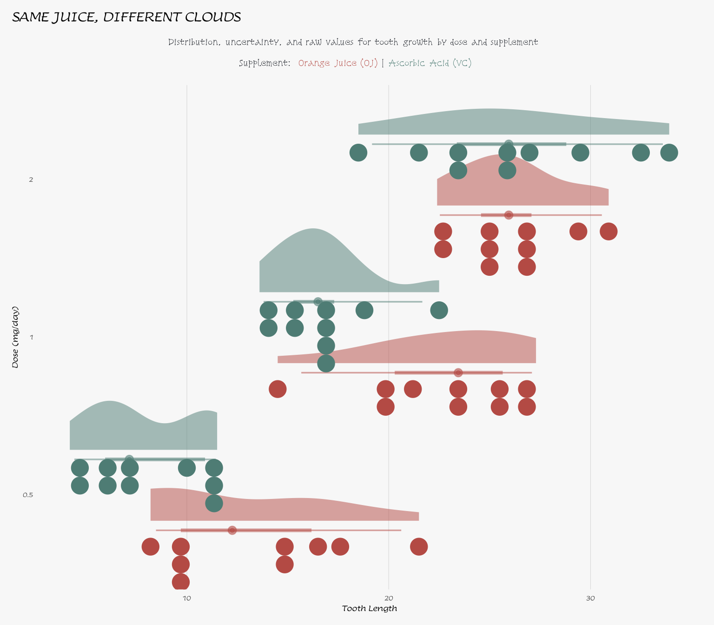

# Beyond Equality: Custom Hypotheses with {statim}

## Rationale

`vignette("htest", package = "statim")` covers the t-test example but a
rudimentary case: is one mean different from a fixed value, and/or are
two means different from each other. Every null hypothesis in that
vignette reduces to `MU(a) == MU(b)` or its one-sample cousin
`MU(a) == mu`.

This vignette is about *using* weighted, non-zero-threshold claims, not
about how
[`state_null()`](https://s7-stats.github.io/statim/reference/null-hyp.md)
parses them. For the parsing mechanics, see
`vignette("hypothesis-expressions", package = "statim")` — this explains
how a coefficient and comparison value are pulled out of an expression
like `2 * MU(x) - MU(y) <= 0`, and why group order in that expression
matters.

Kutner, Nachtsheim, Neter, and Li’s *Applied Linear Statistical Models*
poses a different kind of question throughout its inference chapters:
not “are these equal,” but “is a specific weighted combination of these
parameters above, below, or at some threshold.” That’s a linear
contrast, and [statim](https://github.com/s7-stats/statim) supports it
through `via("contrast")` on the
[`x_by()`](https://s7-stats.github.io/statim/reference/x_by.md) layout,
accepting arbitrary weights (`.w`) and a comparison value (`.mu`) rather
than the fixed `+1`/`-1` split a plain two-sample test assumes.

This vignette isn’t reproducing a specific textbook problem. The book’s
own contrast examples mostly involve three or more groups (its ANOVA
chapters, already covered by
`vignette("anova-mod", package = "statim")`), while `TTEST`’s
[`x_by()`](https://s7-stats.github.io/statim/reference/x_by.md)’s
`contrast` variant is built for exactly two. What it does share with the
book is the *question type*: a weighted, non-zero-threshold claim
instead of a plain equality. The two questions below work that question
type through [statim](https://github.com/s7-stats/statim), using the
same Welch-Satterthwaite machinery the book’s contrast tests are built
on.

## Setup

Here are the imports for the actual showcase:

``` r

box::use(
    statim[
        T_TEST, define_model, prepare, via, state_null, conclude, x_by, MU
    ]
)
```

`ToothGrowth` ships with R, so no import step is needed beyond loading
it:

``` r

data(ToothGrowth)
```

## A look at the data

Both questions below hinge on the size of the OJ-VC gap, so it’s worth
seeing that gap before testing it. Let’s start with stratified summaries
(uncover interactions early):

``` r

box::use(
    dplyr[mutate, group_by, summarise, n],
    forcats[as_factor]
)

ToothGrowth |>
    mutate(dose = as_factor(dose)) |> 
    group_by(supp, dose) |>
    summarise(
        n = n(),
        mean = mean(len),
        sd = sd(len),
        .groups = "drop"
    )
```

``` fansi
# A tibble: 6 × 5
  supp  dose      n  mean    sd
  <fct> <fct> <int> <dbl> <dbl>
1 OJ    0.5      10 13.2   4.46
2 OJ    1        10 22.7   3.91
3 OJ    2        10 26.1   2.66
4 VC    0.5      10  7.98  2.75
5 VC    1        10 16.8   2.52
6 VC    2        10 26.1   4.80
```

Let us check the distribution:

Click here to open

``` r

box::use(
    ggplot2[
        ggplot, aes, labs, theme_minimal, theme, element_blank,
        geom_jitter, position_jitter, element_text, element_line, 
        element_rect, margin, scale_fill_manual, scale_colour_manual, 
        coord_flip, scale_y_continuous
    ],
    ggdist[stat_halfeye, stat_interval, stat_dots],
    patchwork[plot_annotation],
    sysfonts[add_font = font_add_google],
    showtext[showtext_auto],
    ggtext[element_markdown]
)

bg_color = "grey97"
supp_colors = c(OJ = "#B34A44", VC = "#4E7C74")
dodge_width = 0.9

add_font("Lumanosimo", "Lumanosimo")
add_font("Snowburst One", "Snowburst One")
showtext_auto()

subtitle_text = paste0(
    "Distribution, uncertainty, and raw values for tooth growth by dose and supplement ",
    "<br>", 
    "**Supplement:** ",
    "<span style='color:#B34A44;'>**Orange Juice (OJ)**</span> | ",
    "<span style='color:#4E7C74;'>**Ascorbic Acid (VC)**</span>"
)
```

1.  Distribution between `OJ` and `VC`

    ``` r

    ggplot(ToothGrowth, aes(x = supp, y = len, fill = supp, colour = supp)) +
        stat_halfeye(
            alpha = 0.5,
            .width = c(0.5, 0.95),
            point_interval = "median_qi",
            justification = -0.25,
            width = 0.55
        ) +
        geom_jitter(
            position = position_jitter(width = 0.08, height = 0, seed = 1),
            size = 2.2,
            alpha = 0.55,
            show.legend = FALSE
        ) +
        scale_fill_manual(values = supp_colors, guide = "none") +
        scale_colour_manual(values = supp_colors, guide = "none") +
        scale_y_continuous(breaks = seq(0, 35, 10)) +
        coord_flip() +
        labs(
            title = toupper("Same juice, different clouds"),
            subtitle = subtitle_text,
            x = "Supplement",
            y = "Tooth Length"
        ) +
        theme_minimal(base_size = 12, base_family = "Lumanosimo") +
        theme(
            legend.position = "none",
            plot.background = element_rect(colour = NA, fill = bg_color),
            plot.title.position = "plot",
            plot.title = element_text(face = "bold", size = 20),
            plot.subtitle = element_markdown(
                colour = "grey40", size = 13, hjust = 0.5,
                family = "Snowburst One",
                lineheight = 1.3,
                margin = margin(t = 6, b = 14)
            ),
            panel.grid = element_blank(),
            panel.grid.major.x = element_line(linewidth = 0.15, colour = "grey80"),
            axis.text.y = element_text(face = "bold"),
            plot.margin = margin(10, 12, 10, 10)
        )
    ```

    

2.  Separated by `dose`

    ``` r

    ggplot(ToothGrowth, aes(x = factor(dose), y = len, fill = supp, colour = supp)) +
        stat_halfeye(
            aes(fill = supp),
            alpha = 0.5,
            position = "dodge",
            .width = c(0.5, 0.95),
            point_interval = "median_qi",
            justification = -0.15,
            width = 0.9
        ) +
        stat_dots(
            aes(fill = supp),
            side = "bottom",
            justification = 1.05,
            binwidth = NA,
            dotsize = 0.8,
            position = "dodge"
        ) +
        scale_fill_manual(values = supp_colors, guide = "none") +
        scale_colour_manual(values = supp_colors, guide = "none") +
        scale_y_continuous(breaks = seq(0, 35, 10)) +
        coord_flip() +
        labs(
            title = toupper("Same juice, different clouds"),
            subtitle = subtitle_text,
            x = "Dose (mg/day)",
            y = "Tooth Length"
        ) +
        theme_minimal(base_size = 12, base_family = "Lumanosimo") +
        theme(
            legend.position = "none",
            plot.background = element_rect(colour = NA, fill = bg_color),
            plot.title.position = "plot",
            plot.title = element_text(face = "bold", size = 20),
            plot.subtitle = element_markdown(
                colour = "#1D2128", size = 13, hjust = 0.5,
                family = "Snowburst One",
                lineheight = 1.3,
                margin = margin(t = 6, b = 14)
            ),
            panel.grid = element_blank(),
            panel.grid.major.x = element_line(linewidth = 0.15, colour = "grey80"),
            axis.text.y = element_text(face = "bold"),
            plot.margin = margin(10, 12, 10, 10)
        )
    ```

    

## Showcase 1: Clinically Meaningful Superiority

**Question:** Does OJ outperform VC by more than 3 units (a practically
relevant margin)?

H_0: \mu\_{\text{OJ}} - \mu\_{\text{VC}} \leq 3 \qquad H_1:
\mu\_{\text{OJ}} - \mu\_{\text{VC}} \> 3

A plain two-sample test only asks whether the two means differ at all. A
textbook question is sharper: is OJ’s advantage over VC big enough to
matter, not just big enough to be non-zero. Stating `3` as the
comparison value, rather than `0`, is what turns this into a genuine
contrast rather than a relabeled equality test.

``` r

ToothGrowth |>
    define_model(x_by(len, supp)) |>
    prepare(T_TEST) |>
    state_null(
        MU(len, supp == "OJ") - MU(len, supp == "VC") <= 3
    ) |> 
    # This is not needed, unless a weighted "parameter" is present
    via("contrast") |>
    conclude()
```

``` fansi

== Model ======================================================================= 

Variable Mapper : x_by 
Args : len | supp 
    x_vars : 1 
    by_vars : 1 

== T-Test · contrast =========================================================== 

-- Summary ---------------------------------------------------------------------

──────────────────────────────────────────
  group  estimate  t_stat    df    p_val  
──────────────────────────────────────────
  supp    3.700    0.362   55.310  0.359  
──────────────────────────────────────────


-- Confidence Interval ---------------------------------------------------------

─────────────────────────────
  group  lower_95  upper_95  
─────────────────────────────
  supp    0.468      Inf     
─────────────────────────────
```

Interpretation:

- The estimated OJ-VC gap is 3.70, a little above the 3-unit bar, but
  `t_stat` (0.362) and `p_val` (0.359) are testing the gap *against*
  that bar, not against zero. At \alpha = 0.05, `p_val` is too large to
  reject H_0: there isn’t enough evidence that OJ beats VC by more than
  3 units. The one-sided 95% lower bound of 0.468 makes the same point —
  the true gap could plausibly be well under 3.

## Showcase 2: Weighted Dominance

**Question:** Does *twice* the mean under OJ still substantially exceed
the VC mean?

H_0: 2\cdot\mu\_{\text{OJ}} - \mu\_{\text{VC}} \leq 0 \qquad H_1:
2\cdot\mu\_{\text{OJ}} - \mu\_{\text{VC}} \> 0

Unlike 1, the two sides here carry different weights:

- `2` on one group

- `1` on the other

So this isn’t a rescaled version of the same claim. There’s no way to
hand base R’s [`t.test()`](https://rdrr.io/r/stats/t.test.html) a
coefficient per group; the comparison has to be pre-computed by hand
before the call. Here the coefficients live directly in the claim:

``` r

ToothGrowth |>
    define_model(x_by(len, supp)) |>
    prepare(T_TEST) |>
    state_null(
        # If no coefficient 
        # it is hidden and 
        # it contains a coefficient of 1
        2 * MU(len, supp == "OJ") - MU(len, supp == "VC") <= 0
    ) |>
    via("contrast") |>
    conclude()
```

``` fansi

== Model ======================================================================= 

Variable Mapper : x_by 
Args : len | supp 
    x_vars : 1 
    by_vars : 1 

== T-Test · contrast =========================================================== 

-- Summary ---------------------------------------------------------------------

───────────────────────────────────────────
  group  estimate  t_stat    df    p_val   
───────────────────────────────────────────
  supp    24.363   8.563   48.690  <0.001  
───────────────────────────────────────────


-- Confidence Interval ---------------------------------------------------------

─────────────────────────────
  group  lower_95  upper_95  
─────────────────────────────
  supp    19.593     Inf     
─────────────────────────────
```

Interpretation:

- `estimate` (24.363) is 2 \cdot \bar{x}\_{\text{OJ}} -
  \bar{x}\_{\text{VC}} itself, since `.mu` is 0 here. `p_val` is below
  `0.001`, so H_0 is rejected: twice OJ’s mean does not fall short of
  VC’s — it’s well above it. The 95% lower bound of 19.593 says the same
  thing, since it sits nowhere near 0.

## Showcase 3: Dynamic Threshold

**Question:** Is the OJ–VC gap at least 20% of the overall average tooth
length?

H_0: 2\cdot\mu\_{\text{OJ}} - \mu\_{\text{VC}} \leq 0 \qquad H_1:
2\cdot\mu\_{\text{OJ}} - \mu\_{\text{VC}} \> 0

Just like 1, except its two-sample test (or even a fixed-threshold
contrast) only uses static values. Here we use a data-driven threshold
computed from the dataset itself.
[statim](https://github.com/s7-stats/statim) resolves variables from the
environment inside
[`state_null()`](https://s7-stats.github.io/statim/reference/null-hyp.md),
so you can build flexible, context-aware hypotheses without pre-creating
columns or hard-coding numbers.

``` r

overall_avg = mean(ToothGrowth$len)

ToothGrowth |> 
    define_model(x_by(len, supp)) |> 
    prepare(T_TEST) |> 
    state_null(
        # An outside variable `overall_avg` is still 
        # looked up by `state_null()`
        MU(len, supp == "OJ") - MU(len, supp == "VC") <= 0.20 * overall_avg
    ) |> 
    # Again, the "parameters" are not weighted, 
    # so this is unnecessary step
    # Unless you want to
    via("contrast") |> 
    conclude()
```

``` fansi

== Model ======================================================================= 

Variable Mapper : x_by 
Args : len | supp 
    x_vars : 1 
    by_vars : 1 

== T-Test · contrast =========================================================== 

-- Summary ---------------------------------------------------------------------

──────────────────────────────────────────
  group  estimate  t_stat    df    p_val  
──────────────────────────────────────────
  supp    3.700    -0.032  55.310  0.513  
──────────────────────────────────────────


-- Confidence Interval ---------------------------------------------------------

─────────────────────────────
  group  lower_95  upper_95  
─────────────────────────────
  supp    0.468      Inf     
─────────────────────────────
```

Interpretation:

- The estimated OJ-VC gap is 3.70. The dynamic threshold (20% of the
  overall mean) is approximately 3.77, so the observed difference falls
  just short of the bar

- `t_stat` (\approx -0.032) and `p_val` (0.513) test the gap against
  this data-driven value. At \alpha = 0.05, `p_val` is too large to
  reject H_0: there isn’t enough evidence that the true gap exceeds 20%
  of the overall average tooth length. The one-sided 95% lower bound of
  0.468 supports the same conclusion: the advantage could plausibly be
  smaller than our relative threshold.

## References

Kutner, M. H., Nachtsheim, C. J., Neter, J., & Li, W. (2004). *Applied
Linear Statistical Models* (5th ed.). McGraw-Hill/Irwin.

Welch, B. L. (1947). The generalization of “Student’s” problem when
several different population variances are involved. *Biometrika*,
34(1-2), 28-35.

Satterthwaite, F. E. (1946). An approximate distribution of estimates of
variance components. *Biometrics Bulletin*, 2(6), 110-114.
