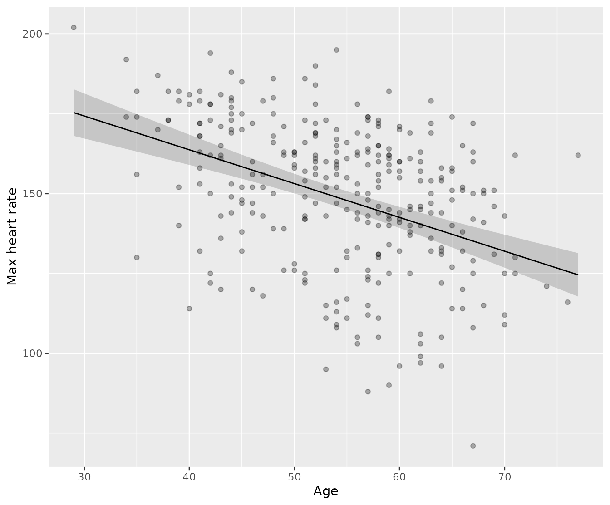

# Predicting with linear models from {statim}

## Rationale

[statim](https://s7-stats.github.io/statim/) has a slight different
approach on making predictions with
[`predict()`](https://s7-stats.github.io/statim/dev/reference/predict.md).
At its core, it’s S7, so strict types when making predictions is
enforced. Its [last
vignette](https://s7-stats.github.io/statim/dev/articles/usage/model-infer.md)
fits two models off the Cleveland Clinic dataset: a linear regression
predicting maximum heart rate from age, sex, and cholesterol, and a
logistic regression (through
[`GLM()`](https://s7-stats.github.io/statim/dev/reference/GLM.md))
predicting the occurence of heart disease from age, cholesterol, and
resting blood pressure. Both came out of the same
`define_model() |> prepare_model() |> conclude()` syntax. This vignette
picks those fits back up and asks the next question: now that you have a
model, what does it say about a patient who isn’t in the dataset yet?

## Setup

Let us used [box](https://klmr.me/box/) package, as per requested by the
author of this package himself. The usage here does not differ from
other vignettes (see
[`vignette("usage/htest")`](https://s7-stats.github.io/statim/dev/articles/usage/htest.md)
and
[`vignette("usage/model-infer")`](https://s7-stats.github.io/statim/dev/articles/usage/model-infer.md)),
where the qualified imports are explictly named.

``` r

# For the examples
box::use(
    statim[
        define_model, prepare_model, via, conclude, predict, 
        LINEAR_REG, GLM
    ],
    stats[binomial]
)

# To handle the data
box::use(
    readr[read_csv], 
    dplyr[mutate, glimpse],
    ggplot2[
        ggplot, aes, geom_point, geom_line, geom_ribbon, labs
    ]
)
```

``` r

heart = 
    read_csv(system.file("extdata", "heart-disease.csv", package = "statim")) |>
    mutate(
        sex = factor(sex, levels = c(0, 1), labels = c("Female", "Male")),
        target = factor(target, levels = c(0, 1), labels = c("No", "Yes"))
    )
```

    
[1mRows: 
[22m
[34m303
[39m 
[1mColumns: 
[22m
[34m14
[39m
    
[36m──
[39m 
[1mColumn specification
[22m 
[36m────────────────────────────────────────────────────────
[39m
    
[1mDelimiter:
[22m ","
    
[32mdbl
[39m (14): age, sex, cp, trestbps, chol, fbs, restecg, thalach, exang, oldpea...

    
[36mℹ
[39m Use `spec()` to retrieve the full column specification for this data.
    
[36mℹ
[39m Specify the column types or set `show_col_types = FALSE` to quiet this message.

``` r

glimpse(heart)
```

``` fansi
Rows: 303
Columns: 14
$ age      <dbl> 63, 37, 41, 56, 57, 57, 56, 44, 52, 57, 54, 48, 49, 64, 58, 5…
$ sex      <fct> Male, Male, Female, Male, Female, Male, Female, Male, Male, M…
$ cp       <dbl> 3, 2, 1, 1, 0, 0, 1, 1, 2, 2, 0, 2, 1, 3, 3, 2, 2, 3, 0, 3, 0…
$ trestbps <dbl> 145, 130, 130, 120, 120, 140, 140, 120, 172, 150, 140, 130, 1…
$ chol     <dbl> 233, 250, 204, 236, 354, 192, 294, 263, 199, 168, 239, 275, 2…
$ fbs      <dbl> 1, 0, 0, 0, 0, 0, 0, 0, 1, 0, 0, 0, 0, 0, 1, 0, 0, 0, 0, 0, 0…
$ restecg  <dbl> 0, 1, 0, 1, 1, 1, 0, 1, 1, 1, 1, 1, 1, 0, 0, 1, 1, 1, 1, 1, 1…
$ thalach  <dbl> 150, 187, 172, 178, 163, 148, 153, 173, 162, 174, 160, 139, 1…
$ exang    <dbl> 0, 0, 0, 0, 1, 0, 0, 0, 0, 0, 0, 0, 0, 1, 0, 0, 0, 0, 0, 0, 0…
$ oldpeak  <dbl> 2.3, 3.5, 1.4, 0.8, 0.6, 0.4, 1.3, 0.0, 0.5, 1.6, 1.2, 0.2, 0…
$ slope    <dbl> 0, 0, 2, 2, 2, 1, 1, 2, 2, 2, 2, 2, 2, 1, 2, 1, 2, 0, 2, 2, 1…
$ ca       <dbl> 0, 0, 0, 0, 0, 0, 0, 0, 0, 0, 0, 0, 0, 0, 0, 0, 0, 0, 0, 2, 0…
$ thal     <dbl> 1, 2, 2, 2, 2, 1, 2, 3, 3, 2, 2, 2, 2, 2, 2, 2, 2, 2, 2, 2, 3…
$ target   <fct> Yes, Yes, Yes, Yes, Yes, Yes, Yes, Yes, Yes, Yes, Yes, Yes, Y…
```

Refit the two models from the [regression
vignette](https://s7-stats.github.io/statim/dev/articles/usage/model-infer.md):

``` r

mod1 = heart |>
    define_model(thalach ~ age + sex + chol) |>
    prepare_model(LINEAR_REG) |>
    conclude()

mod2 = heart |>
    define_model(target ~ age + chol + trestbps) |>
    prepare_model(GLM, family = binomial()) |>
    conclude()
```

## Predicting from first model

The first model refers to the first code above, namely `mod1`, an
example of a classic linear regression. Suppose a clinician wants to
know what `mod1` implies for one particular patient: 63 years old, male,
cholesterol 275. That’s a single row, built by hand, evaluated against
the fitted equation:

``` r

patient = data.frame(
    age = 63,
    sex = factor("Male", levels = levels(heart$sex)),
    chol = 275,
    trestbps = 145
)

predict(mod1, new_data = patient, interval = "confidence")
```

``` fansi
# A tibble: 1 × 3
  .pred .pred_lower .pred_upper
  <dbl>       <dbl>       <dbl>
1  140.        136.        144.
```

`interval = "confidence"` is simply passed to
[`auto_predict()`](https://s7-stats.github.io/statim/dev/reference/auto_predict.md)
from `class_lm_object` class, which produces confidence interval
estimates that answers “how sure is the model about the *average*
patient with this profile”. `interval` has another option:
`"prediction`, produces confidence interval estimates that answers “how
sure is the model about *this one* patient”.

``` r

predict(mod1, new_data = patient, interval = "prediction")
```

``` fansi
# A tibble: 1 × 3
  .pred .pred_lower .pred_upper
  <dbl>       <dbl>       <dbl>
1  140.        98.7        182.
```

The same operation on `mod2` reads through the inverse link by default,
so it comes back as an implied probability rather than a heart-rate
value:

``` r

predict(mod2, new_data = patient, interval = "confidence")
```

``` fansi
# A tibble: 1 × 3
  .pred .pred_lower .pred_upper
  <dbl>       <dbl>       <dbl>
1 0.407       0.325       0.494
```

`interval = "prediction"` isn’t offered for `mod2` at all. GLMs have no
closed-form prediction error the way OLS does, so rather than return
something that looks precise but isn’t, that argument value simply
doesn’t exist for this model.

## A fitted curve for plotting

[statim](https://s7-stats.github.io/statim/)’s
[`predict()`](https://s7-stats.github.io/statim/dev/reference/predict.md)
is strictly typed: by default it ensures that the output must produce a
data frame. How about we visualize them for better interpretability?

Evaluate `mod1` across a range of ages, holding the other predictors
fixed, to draw the fitted relationship itself. This is the same
fitted-line-with-band you’d see in any applied regression chapter, made
by evaluating the equation at many covariate points rather than one:

``` r

age_grid = data.frame(
    age = seq(min(heart$age), max(heart$age), length.out = 50),
    sex = factor("Male", levels = levels(heart$sex)),
    chol = mean(heart$chol)
)

fitted_curve = predict(mod1, new_data = age_grid, interval = "confidence") |> 
    mutate(age = age_grid$age)

ggplot(fitted_curve, aes(age, .pred)) +
    geom_ribbon(
        aes(ymin = .pred_lower, ymax = .pred_upper), 
        alpha = 0.2
    ) +
    geom_line() +
    geom_point(data = heart, aes(age, thalach), alpha = 0.3) +
    labs(y = "Max heart rate", x = "Age")
```



Nothing here was held out or scored for accuracy. Every one of those
fifty ages is a point on the same curve implied by the coefficients
`mod1` already reported, with cholesterol pinned at its mean and sex
pinned at “Male” so the curve isolates the effect of age alone.

## On ergonomicity

Base R’s `predict.lm` returns a vector, a matrix, or a list depending on
which arguments you passed.
[statim](https://s7-stats.github.io/statim/)’s
[`predict()`](https://s7-stats.github.io/statim/dev/reference/predict.md)
always returns the same shape — `.pred`, `truth` when honest,
`.pred_lower`/`.pred_upper` when requested — no matter whether it’s
`mod1` or `mod2` underneath, or one hand-built row versus a fifty-row
grid for a plot.

That consistency comes from one generic,
[`auto_predict()`](https://s7-stats.github.io/statim/dev/reference/auto_predict.md),
which any package can implement once for its own result class and get
[`predict()`](https://s7-stats.github.io/statim/dev/reference/predict.md)
for free — no changes to [statim](https://s7-stats.github.io/statim/)
itself required. What differs is just which arguments a model can
honestly support: `interval = "prediction"` for `class_lm_object`, not
for `class_glm_object`; `type` only for the GLM. See
[`?class_lm_object`](https://s7-stats.github.io/statim/dev/reference/class_lm_object.md)
/
[`?class_glm_object`](https://s7-stats.github.io/statim/dev/reference/class_glm_object.md)
for specifics.
